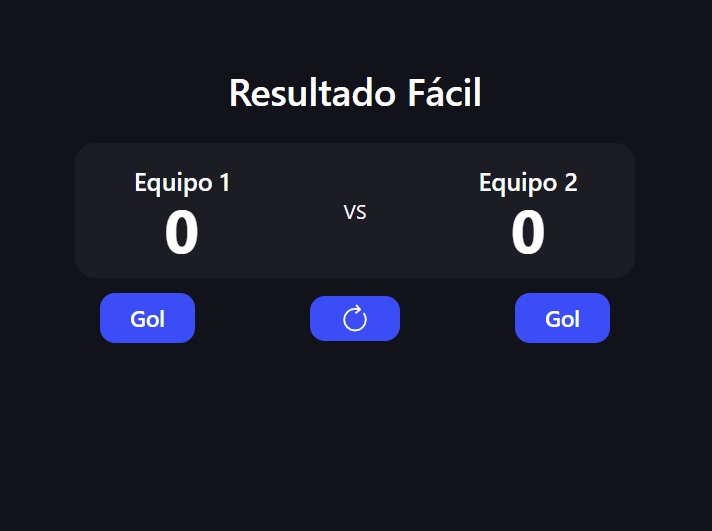

# Contador de Resultados de Partidos

  

## 🚀 Introducción

Este proyecto es un **contador de resultados de partidos** desarrollado con **React**, **Tailwind CSS** y **Vite**. Surgió como una mejora a un simple contador, dándole una utilidad práctica: llevar el marcador de un partido en tiempo real. Además, se implementó **Storybook** para documentar y probar los componentes de manera aislada.

El objetivo principal fue mejorar mis habilidades en:
- **Testing**: Uso de **Vitest** para pruebas unitarias.
- **Documentación**: Implementación de **Storybook**.
- **Diseño**: Uso de **Tailwind CSS** para estilos rápidos y responsivos.
- **React**: Buenas prácticas y estructura de componentes.

---

## 🛠️ Tecnologías Usadas

- **React**: Biblioteca principal para la construcción de la interfaz.
- **Tailwind CSS**: Framework de estilos para diseño rápido y responsivo.
- **Vite**: Herramienta de construcción para desarrollo rápido.
- **Vitest**: Framework de testing para pruebas unitarias.
- **Storybook**: Herramienta para documentar y probar componentes de manera aislada.

---

## 📦 Instalación y pruebas

Sigue estos pasos para ejecutar el proyecto en tu máquina local:

1. Clona el repositorio:
   `git clone https://github.com/hernanyarbi/scoreboard-react.git`
2. Ve a la carpeta del proyecto:
  `cd scoreboard-react`
3. Instala dependencias:
  `yarn` o `npm i`
4. Levantar el proyecto: 
  `yarn dev` o `npm run dev`
5. Correr los tests:
  `yarn test:unit` o `npm run test:unit`
6. Levantar la documentación de storybook:
  `yarn storybook` o `npm run storybook`
  
